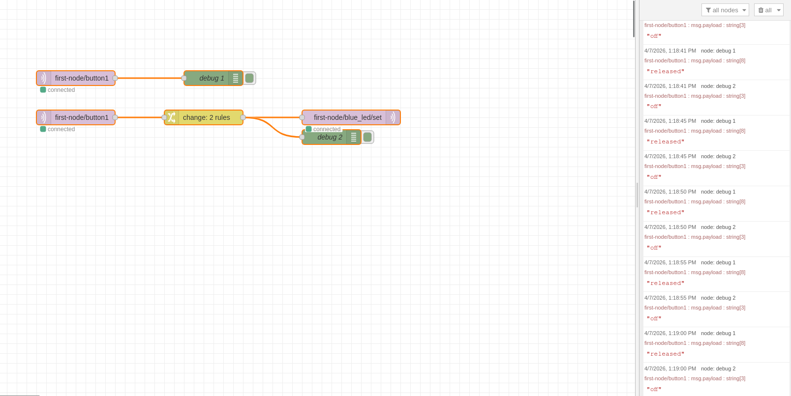
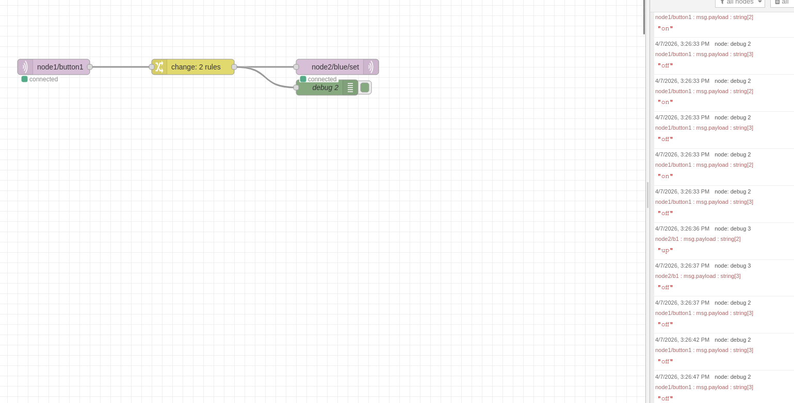
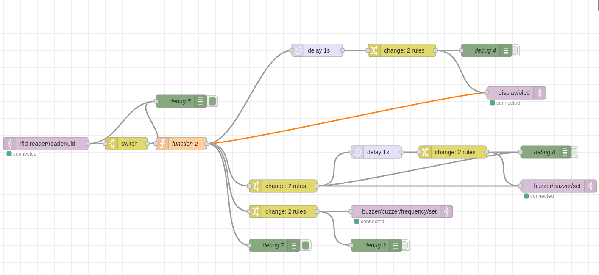

# Task 1 - Creating Your First IoT System

Pressing the button toggles the value pressed / released which can toggle the LED on / off.

The Node-Red flow:

# Task 2 - Second Node

Pressing the button on one node toggles the value pressed / released which can toggle the LED on / off on the second node.

The Node-Red flow:

# Task 3 - rebuild access control system with IoTempower (4+ nodes)

Using two D1 Minis and one ESP32, we connected a RFID reader, a buzzer and an OLED screen to display "granted" and make high pitched noise, if access is granted.

The Node-Red flow:

